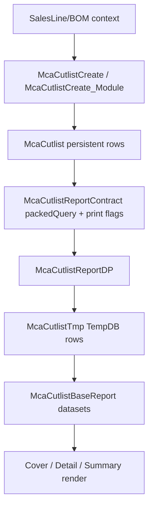

# Data Lineage

## Field lineage highlights
- `SalesLineRefRecId` -> used to resolve `KanbanId` (`SalesLine.SalesId`) in DP.
- `MoveToAreaId` -> DP resolves `MoveToLocation` description.
- `Pieces` and `KitQty` are transformed differently per DP path (detail expands pieces).
- `MachineFilename` detail display uses filename-only extraction helper.

## Reconciled notes
- `.md` analysis indicates DEV introduces `Per_Series` pipeline and formula changes.
- Production XPO snapshot here does not expose that field in report dataset.
